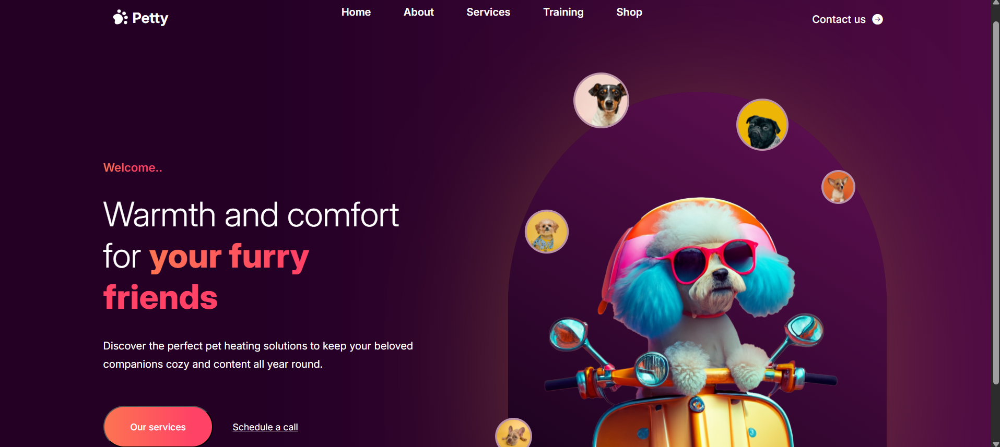

# 🐾 Petty – Hero Page for Dog Heating Solutions

This is a front-end recreation of a Canva design built entirely with **HTML** and **CSS**. It showcases a visually immersive and responsive **hero section** for a fictional brand offering heating solutions for dogs. The goal was to translate a static design into a polished, code-based interface with modern web practices.
## 🎯 Purpose

This project was created as a practice in HTML/CSS translation of UI design, focusing on responsive layouts, immersive visuals, and clean code structure. It serves as a portfolio piece to demonstrate design-to-code capabilities.

## 🌟 Features

- Fully **responsive design** for desktop, tablet, and mobile
- Eye-catching **visual hierarchy** and layout
- Use of **positioning techniques**
- Accessible and semantic HTML structure
- Designed for readability and strong first impressions

## 🔧 Built With

- HTML5
- CSS3

## 📸 Preview


[🔗 Live Demo](https://rainydeville.github.io/hero-page-css/)

## 🧪 Usage

1. Clone or download the repo:
   ```bash
   git clone https://rainydeville.github.io/hero-page-css.git
   ```

## 👩‍💻 Author

Built with care and pixels by Rainy